# Gorgon Gorge

Gorgon Gorge is a text based role playing game where the player takes control of a character and has to fight a series of battle in order to win. There are 5 battles in total, with enemy stats and behaviours dependent on the nature they are assigned on creation, and get progressively harder as the player goes on. Gold is obtained from these monsters which can be used outside of a battle to upgrade your stat points, increasing your odds of winning the next battle. In between battles are some light narrative descriptions of the area the player is in in order to set the stage and make the game feel like an adventure.

The project is essentially split into 3 "screens" - field, battle and shop, which the player cycles through. On the field is where narrative text is displayed and a player can choose to navigate to the shop to upgrade their stats, or move on to the next battle. The shop allows the trade of gold for items and stat upgrades, and the battle is where the fights with the monsters take place. Fights are designed to feel difficult at first, so to act as puzzles for the user to work out how to optimally build their character and handle the fights in order to increase replayability and enjoyment as they get further in.

[Gorgon Gorge live project](https://gorgon-gorge-c271c0720f84.herokuapp.com/)
- - -
## Table of Contents

### [User Experience (UX)](#user-experience-ux-1)
### [Design](#design-1)
* [Initial Flowchart](#initial-flowchart)
### [Features](#features-1)
* [Future Features](#future-features)
### [Technologies Used](#technologies-used-1)
### [Frameworks, Libraries & Programs Used](#frameworks-libraries--programs-used-1)
### [Testing](#testing-1)
* [Linter Testing](#linter-testing) 
* [Manual Testing](#manual-testing)
* [Input Validation Rules and Testing](#input-validation-rules-and-testing)
* [Bugs Fixed](#bugs-fixed)
### [Deployment](#deployment)
### [Credits](#credits-1)
### [Acknowledgements](#acknowledgements-1)
---

## User Experience

As the UI is text based I felt it was important to always list the commands that players could use whenever user input was available in order to minimise any frustration or guesswork the player would have to do. If the player does input something invalid I ensure that an error message appears that explains why. Due to the lack of GUI this was important as I want the player to enjoy playing the game and not be struggling with the interface.

The formatting of the text and the position of line breaks was important to me too, as remaining consistent with when line breaks would happen just looks better and makes for a more positive user experience. Pauses using the sleep module are placed here and there throughout in order to keep the test flow feeling varied and keeping the user engaged. Small pauses happen after attacking to increase tension before seeing if the attack hits or misses - similarly they are used before key mechanics in the Gorgon fight for dramatic effect which helps keeps the player engaged.

The difficulty of the fights are designed to be challenging but still doable - the idea being the player will want to come back and use the knowledge that they have gained to build their character better and use their new knowledge to form a strategy the next time they get to that fight, in order to overcome the obstacle in front of them leading to a greater sense of satisfaction when they do win. The narrative bigs up the Gorgon as this fierce, legendary creature - if the player was to beat them the first time it was encountered then this would feel anticlimatic. As it stands now the fight should feel tense and desperate so that if the player does win they feel like they have accomplished something great.

Feedback in the player's builds when increasing their stats are apparent immediately too, which adds to the user's engagement. The difference in a few points of attack and defense are apparent as soon as they go into the next fight and helps the player feel like they have agency in the descisions that they make.

All descisions made during the development of this game were with the player's enjoyment in mind and with the thought process that the game should be tough but fair, and not frustrating. If something seems insurmountable there should be a way to get around it easily with a bit of thought in both the player's approach to the battle and the way they advance their character.

First time players and returning players may have different approaches to how they play the game, as determined below:

* First time players
    * Learn the rules of the game.
    * Learn the inputs required for specific screens.
    * Get a grasp of the flow of the game.
    * Try to beat the game.

* Returning players
    * Use the knowledge they gained from previous plays and attempt to beat the game with new strategies in mind if they didn't already win.
    * Try to beat the game faster with a more refined build if attempting to beat the game again.
---

## Design

### Initial Flowchart

Design Flowchart

 

  

### Changes from Initial Design

There were several changes to the design of the game from the flowchart above - the biggest of these were the way upgrades were handled in the shop. The initial idea was to have equipment that could be added to the shop as the player advanced further, and they could equip this gear in order to increase their stats. This brought several challenges into view however - how would I deal with: displaying the statistics of the items before purchasing them or the usecase of a player buying a worse piece of gear than they have equipped. With the latter I would have needed to implement an inventory system and allow for it to be swapped out at will. The more I thought about this the more the scope of the project increased, so the descision was made to just directly upgrade the statistics of the player which would increment the variables assigned to the player character object directly.

A few other minor things were changed from the flowchart, mostly for balance purposes that became apparent during testing:

* Fleeing chance increased to 60% over proposed 50% - I wanted the chance to flee to be slightly skewed towards being successful to encourage players to use it but keep the risk/reward factor.
* Defending increases defense value by 2.5 rather than the proposed increase of +20 - This allows for defending to properly scale as the player increases their stats.
* Enemies are not randomised in difficulty bands, there is a set enemy depending on where the player is up to but with randomised statistics and behaviours - This proved easier for balance as I can better keep track of what the players stats will be at, allowing for a more finely tuned and tense difficulty throughout, while still keeping an element of randomness as enemy attack patterns can change from run to run.
* Status command works on shop and battle screen in addition to the field screen - allowing the player to access this information wherever they are allows them a greater picture of their situation wherever they are so they can make a fully informed descision on what to do next.
* Potion command works on field screen - allows players to restore their health outside of battle.
* Added critial hits, misses & slight damage varience per hit - While not on the initial design doc I thought having a small chance to miss and do extra damage would be more fun and lead to more exciting encounters. Every hit has a 1/20 chance to miss and a 1/10 chance to critically hit - As well a this I added a chance for attacks to sometimes deal an extra 1 or 2 damage than the formula should allow in order to vary up the numbers that are showing up on screen to keep the player more engaged and make the game feel more interesting.

## Features

### Field Screen

* Narrative display - Narrative descriptive text shows when entering the field screen for the first time after starting or beating a monster. It won't display again if the player flees from an encounter or returns to the field screen via the shop. 
   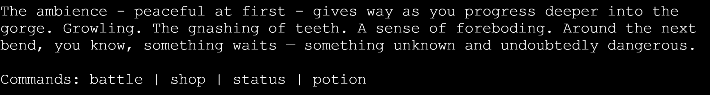

* Navigation to shop & battle screen - From this screen the player can navigate to the shop to increase their stats or purchase potions, or they can advance to the next battle.
* Status - Shows a display of the adventurer's name, current stats (current / max hp, attack, defense, gold and potion count). Allows for the player to make a more informed descision about what they want to do next, or what stats to focus on improving for example. This command is also available in the shop and during battle.
  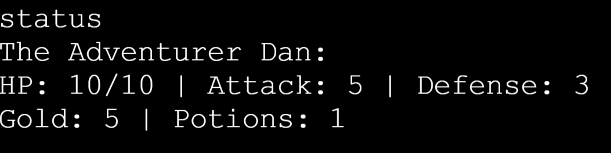

* Potion - Allows the player to expend a potion in order to restore 50% of their maximum HP (rounded up). This command is also available during battle.
 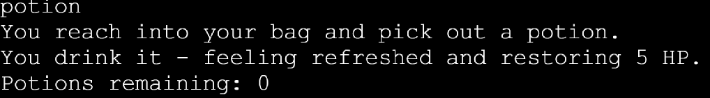

### Shop Screen

* Shop display - Displays what the shop has for sale and the amount of gold that each potion / stat increase requires.
  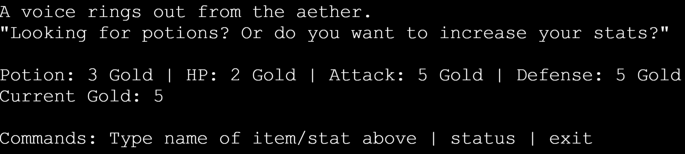

* Item input - The player can type potion or the stat the want to increase before being moved onto the quantity input.
  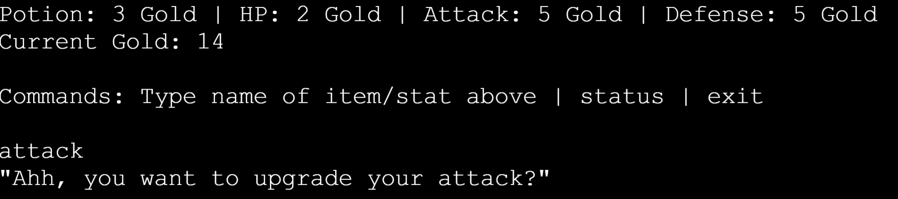

* Quantity input - The player inputs how many of that item or stat increases they want to purchase. This can be done with either a numerical input or a string (e.g "two") which is then converted to an integer using the wordtodigits module.
  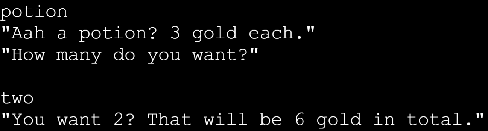

* Confirm input - Displays how much gold in total the desired purchase will cost and asks the player to confirm. If the player confirms but does not have the amount of gold required then the shopkeeper will say this, else they will thank the player and complete the transaction. After both cases the user will be returned to the initial shop display where they can continue making transactions or return to the field screen.
  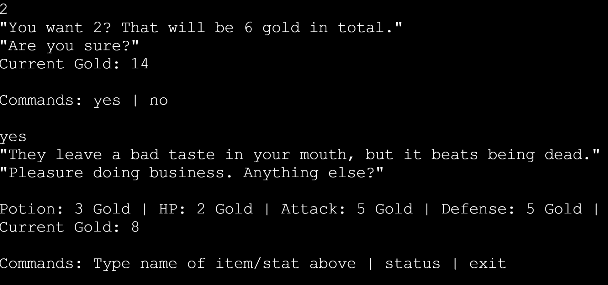

* Navigation to field screen - When the player is done upgrading their character they can choose to return to the field screen.

### Battle Screen

* Monster generation - The monsters the player encounters are set in a specific order, but attack patterns and stats are determined by their nature which can change from battle to battle. Care was taken to try and make each monster feel unique and different compared to other ones through the use of their descriptive text and also by having them introduce new and sometimes unique mechanics to each encounter. The monsters you encounter and a brief overview of those mechanics can be seen below.

    

    
Monster nature / mechanic overview (spoiler warning)

    | Monster name | Number of natures to draw from | New / Unique mechanic |
    | -------------|--------------------------------|-----------------------|
    | Goblin | 4 | Charge attack - takes a turn to build up an attack that will critically hit the player, giving the player warning so they can defend. |
    | Siren | 2 | Their song builds and eventually reduces player HP to 1 |
    | Sprite | 2 | Evasion - can get very fast for a few turns and increases chance for the player to miss their attack significantly. |
    | Troll | 2 | Can increase their own stats - specifically their attack at the expense of a bit of their health. Turns the fight into a race with ever-increasing damage values. |
    | Gorgon | 1 | Gaze - When all snakes are lifted from the Gorgon's eye, if the player is not defending they will be turned to stone and lose. Player has to keep track of these and defend at the right moment. The player's defend command shows alternative text describing hiding behind their shield and blocking the gorgon from view during this fight in order to give a clue of this. |
    | | | HP regeneration - When the player doesn't hurt the Gorgon on that turn, a small amount of HP will be regenerated.  |
    | | | Reduce player defense - If the player defends and the next attack isn't a gaze or a charge attack, the gorgon will punish the player by reducing their defense by 1 permanently. This is to encourage keeping proper track of the gaze mechanic so players can't just spam the defend command. |
    

    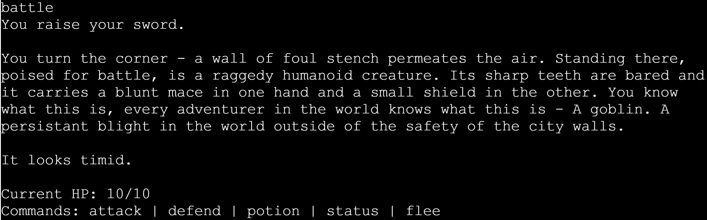

* Attack - Player types attack and attempts to hit the creature. The game generates a number between 1 and 20 every time and depending on the result does the following:

    | Random number   | Outcome | Notes |
    | -------- | --------------- | ------------------|
    | 1  | Player misses | Player deals no damage to the enemy, flavour text showing the monster dodging the attack is displayed, essentially losing a turn. |
    |2 - 18 | Player hits | Player deals damage to the enemy - formula is (player attack - monster defense) + 1 or 2 variance. |
    |19 - 20| Player critical hits | Player deals extra damage to the enemy, flavour text shows a powerful strike has landed - Formula is (player attack x 2) - monster defense. |

      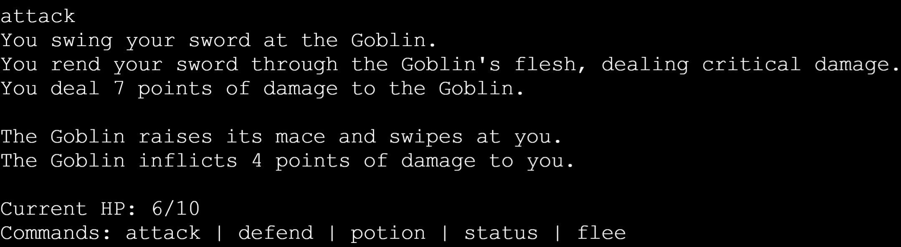
* Defend - Player types defend and spends a turn vastly increasing their defense (x2.5). 
  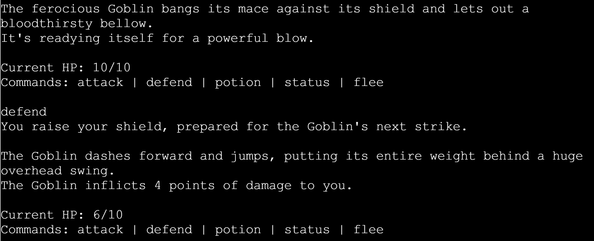

* Flee - 60% chance of fleeing the battle. If successful the player returns to the field screen and retains their character state - next time they go into battle a new enemy is generated so the nature of the creature can change. Narrative text also changes upon re-entering a battle to make it clear it's a different entity to the first monster that was encountered.
  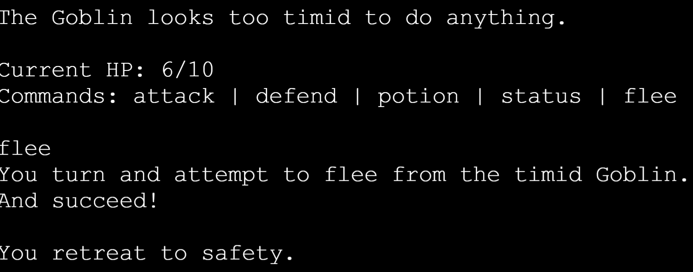

* Looting monster - Once the monster is dead players are required to input if they want to loot or leave the body - looting grants them some gold, while leaving gives them nothing. There is no advantage to not looting, and this was mostly implemented to give the player options for challenge runs and also to help with pacing to stagger the text and require an input in between the end of the fight and the next descriptive text appearing.
  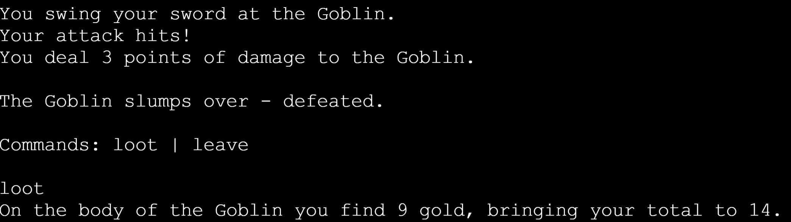

### Other

* Name input - At the start of the game the user will enter the name of their character. This will display at various points, including on the status screen when the player wants an overview of their character.
  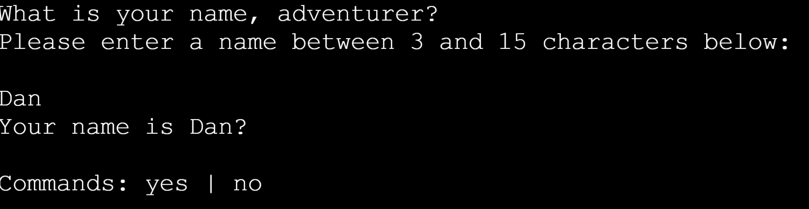

* Win screen - Once the Gorgon has been defeated the player wins the game. Brief narrative text congratulates them before updating their name to include ", The Gorgon Slayer" as their title, and then displays the statistics screen to show the end state of character on their winning run. After this it asks if the player wants to start again or quit the game.
  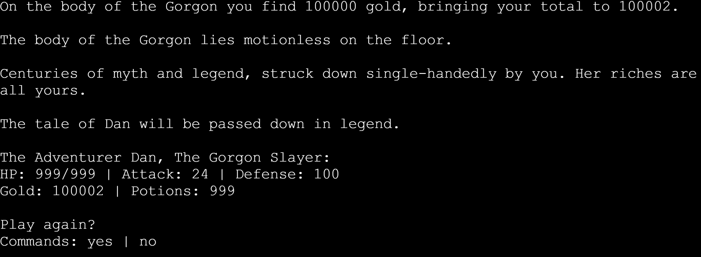

* Lose screen - If the player is reduced to 0 HP then the player loses the game. Brief narrative text explains that they have lost, and perhaps the next adventurer will fare better, before asking whether they want to start again or quit the game.
  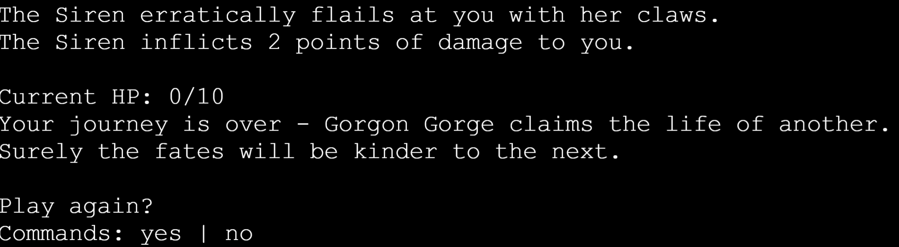

### Future Features

Several potential features that further improve the game have been indentified and could be implemented in the future.

* More monster natures - More natures for the monsters means more variety in the fights and leads to more options for player choices.
* Coloured text - This could be introduced sparringly for emphasis, for example red text when the player loses the game, or text that slowly gets lighter as if it is fading out when the player gets turned to stone by the Gorgon.
* Events in between fights - Semi-randomised events could be introduced in between battles, for example a fork in the road and the player must choose which way to go. One route could lead to a chest with a random stat increase inside, the other to spring that restores their HP. 
* Upgradable critical hit threshold - When attacking, a roll of a 19 or 20 gives the player a critical strike. This could be implemented as a shop item several fights in that would increase the chance of a crit to include an 18, then a 17, etc.

---

## Technologies Used  

 * [Python](https://en.wikipedia.org/wiki/Python_(programming_language))

---

## Frameworks, Libraries & Programs Used

 * [Visual Studio Code](https://code.visualstudio.com/)
    * To write the code.
 * [Git](https://git-scm.com/)
    * For version control.
 * [Github](https://github.com/)
    * Deployment of the program and storing the files online.
 * [Heroku](https://heroku.com/)
    * To deploy the project.
 * [CI Python Linter](https://pep8ci.herokuapp.com/)
    * To check code for any significant issues.
 * [Draw.io](https://draw.io/)
    * To create the initial logic flowchart for the project.

---

## Testing

### Linter Testing

CI Python Linter was used to test run.py

 

 The only issues that remain during this test are related to line length - while the terminal allows the display of a maximum of 80 characters and some narrative strings are above this, I import and use the textwrap module to keep them all on one line within those 80 characters, so I felt these weren't significant issues that needed fixing.

### Manual Testing

Manual testing table

| Feature | Expected Result | Steps taken | Working as intended? |
|---------|-----------------|-------------|----------------------|
| Input validation | All inputs should accept only what they are designed to accept and function properly. | Testing all inputs with incorrect and correct data | Yes - See [Input Validation Rules and Testing](#input-validation-rules-and-testing) below for more details |
| Using potions | Potions can only be used if player has at least one, and restores 50% of their max hp rounded up. If player has more than 50% of their hp, then it caps at the max-hp value | Used potion with 0 in inventory, several in inventory, and at different current hp values | Yes |
| Status menu | Brings up the status menu while on field, battle or shop screen. Displays information on the character that is always up to date. | Brought up status screen on every available screen, tested before and after purchases to ensure stat changes are properly reflected | Yes |
| Narrative field screen text | Should only display either after making a new character, or after beating a monster. If the player flees and returns there, or returns there from the shop, brief alternate text should display instead. | Leave shop, flee battle | Yes
| Monster intro text | Text should be different if it's the first time entering a battle with the monster vs if the player is returning after fleeing | Flee from battle then re-enter | Yes
| Battle commands | All battle commands work as intended. Player and monsters take a turn each per round - when one is reduced to 0 hp then the battle ends.| Tested all battle commands in each battle, win and lose each battle. | Yes |
| Shop | Player can buy potions or upgrade stats with a quantity of their choosing | Bought varying amounts of stat points at different times, saw them updated in the stat screen | Yes
| Natures correctly effect monster behaviour | The nature of a monster is displayed before the battle begins, and that nature should correspond to their set behaviour and attack patterns | Tested to make sure each nature can appear and the monsters stats and actions are properly reflective of what they should be | Yes
| All unique monster mechanics function as intended | Per the monster table in the design section of this document, each monster has unique mechanics that should all work as intended | Thoroughly tested each fight - printed monster stat values to console in the event that they change to ensure these changes are made at the right time. Have purposely failed each mechanic. | Yes - see [Battle Screen](#battle-screen) monster table for more details on these mechanics |
| Player wins | Player defeats the Gorgon and is taken to the victory screen, name is updated with new title ", The Gorgon Slayer" | Won the game | Yes
| Player loses | Player is reduced to 0 hp, is taken to the lose screen. | Lose the game | Yes

### Input Validation Rules And Testing

All string inputs listed below can be accepted in any case - the program converts them to lowercase before checking if they are valid.

Input validation rules and testing table

 | Input Location | Accepted Inputs / Rules | Working as intended? |
 |--------------|------------|---------------------|
 | Title screen | Start | Yes - Starts game|
 |               | Quit  | Yes - Quits game|
 | Player name input | Must be alphabetical characters or spaces and be between 3-15 characters | Yes - Moves onto player name confirmation
 |  | Can't be less than 3 or more than 15 characters | Yes - Displays invalid input and asks user again
 |  | Can't be blank or consist entirely of spaces | Yes - Displays invalid input and asks user again
 | Confirm player name | Yes | Yes - Moves player to field screen and displays intro text.
 | | No | Yes - Returns player to name input to input another name
 | Field Screen | Battle | Yes - Advances player to battle
 |              | Shop   | Yes - Takes the user to the shop
 |              | Status | Yes - Displays player statistics
 |              | Potion | Yes - Uses a potion if the player has one, or tells them they dont have any to use.
 | Shop Screen  | Potion | Yes - Moves player onto quantity selection
|              | HP     | Yes - Moves player onto quantity selection
|               | Attack | Yes - Moves player onto quantity selection
|               | Defense | Yes - Moves player onto quantity selection
|               | Status | Yes - Displays player statistics
|               | Exit | Yes - Navigates player to the field screen
| Shop - Quantity Selection | Must be a number between 0 and 99 (int or string works) | Yes - Move onto purchase confirmation if number is greater than 0. If number is 0 then moves player back to initial shop screen.
|                           | Can't be blank or consist entirely of spaces | Yes - Displays invalid input and asks user again
|                            | Can't be a number above 99 or a negative number | Yes - Displays invalid input and asks user again
| Shop - Purchase Confirmation | Yes | Yes - Player either gets what they asked for it they have enough gold, or is told they can't afford it if they dont. Moves the player back to the intital shop screen regardless of outcome. |
|                              | No | Yes - Player is moved back to initial shop screen |
| Battle Screen | Attack | Yes - Player uses the attack command. Monster then does an action before returning to this screen if no one has won.
|               | Defend | Yes - Player uses the defend command. Monster then does an action before returning to this screen if no one has won.
|               | Potion | Yes - Player uses a potion if they have one available, restores health and monster does an action before returning to this screen if no one has won. If the player has no potions then tells the player this and allows them to pick another action.
|               | Status | Yes - Displays player statistics and allows them to pick another action.
|               | Flee | Yes - Player uses the flee command. If they are successful then the player returns to the field screen, if they are not then the monster does an action before returning to this screen if no one has won. |
| Battle Won | Loot | Yes - Player gets the gold value of the monster in gold and moves them onto the field screen with new narrative text |
|            | Leave | Yes - Moves onto the field screen with new narrative text
| Game End - "Play again?" | Yes | Yes - Moves player back to the title screen to start the game again |
|                        | No | Yes - Quits the game 

### Bugs Fixed

| Bug Description | Fixed? |
|-------------|--------------|
| When inputting the player name, if the player selects no when asked for confirmation and then picks a different name, the game would then ask for confirmation twice and apply the first name that the player chose despite originally saying no. | Yes  - moved field_screen() call into player_name_input() rather than main.|
| During the Gorgon battle, erroneously defending displays that player defence has been lowered but on the status screen it shows that the player's defense remains the same. | Yes - Player defense value is captured in a variable upon using the defense command, and is then multiplied by 2.5 when defending before being reverted back to the captured value at the end of the turn. Initial reduction was updating the multiplied value but was then being reverted to the initial, unchanged captured value. Made the captured value global and updated that instead - now works as intended.
| Various whitespace and formatting issues showing during linter testing | Yes - Removed any extra whitespace at the end of lines and spaced functions out according to best practises  

---

## Deployment

### Deploying to Heroku

To deploy with Heroku, Code Institute Python Essentials Template was used so the python code can be viewed in a terminal in a browser.

1. Log in to Heroku or create a new account
2. On the main page click "New" and select "Create new app"
3. Choose your unique app name and select your region
4. Click "Create app"
5. On the next page find "settings" and locate "Config Vars"
6. Click "Reveal Config Vars" and add "PORT" key and value "8000", click "Add"
7. Scroll down, locate "Buildpack" and click "Add", select "Python"
8. Repeat step 7. only this time add "Node.js", make sure "Python" is first
9. Scroll to the top and select "Deploy" tab
10. Select GitHub as deployment method and search for your repository and link them together
11. Scroll down and select either "Enable Automatic Deploys" or "Manual Deploy"
12. Deployed site [Gorgon Gorge](https://gorgon-gorge-c271c0720f84.herokuapp.com/)

### Forking the GitHub Repository

By forking the repository, we make a copy of the original repository on our GitHub account to view and change without affecting the original repository by using these steps:

1. Log in to GitHub and locate [GitHub Repository Gorgon Gorge](https://github.com/dlynch92/gorgon-gorge)
2. At the top of the Repository(under the main navigation) locate "Fork" button.
3. Now you should have a copy of the original repository in your GitHub account.

### Local Clone

1. Log in to GitHub and locate [GitHub Repository Gorgon Gorge](https://github.com/dlynch92/gorgon-gorge)
2. Under the repository name click "Clone or download"
3. Click on the code button, select clone with HTTPS, SSH or GitHub CLI and copy the link shown.
4. Open Git Bash
5. Change the current working directory to the location where you want the cloned directory to be made.
6. Type `git clone` and then paste The URL copied in the step 3.
7. Press Enter and your local clone will be created.

---

## Credits

* All code written by myself
* Title screen flavour text generated with [ChatGPT](https://chatgpt.com/)
* [Thomas-Tomo's hangman](https://github.com/Thomas-Tomo/hangman) for the Readme template.

---

## Acknowledgements
* My mentor Mitko Bachvarov for tips and encouragement.